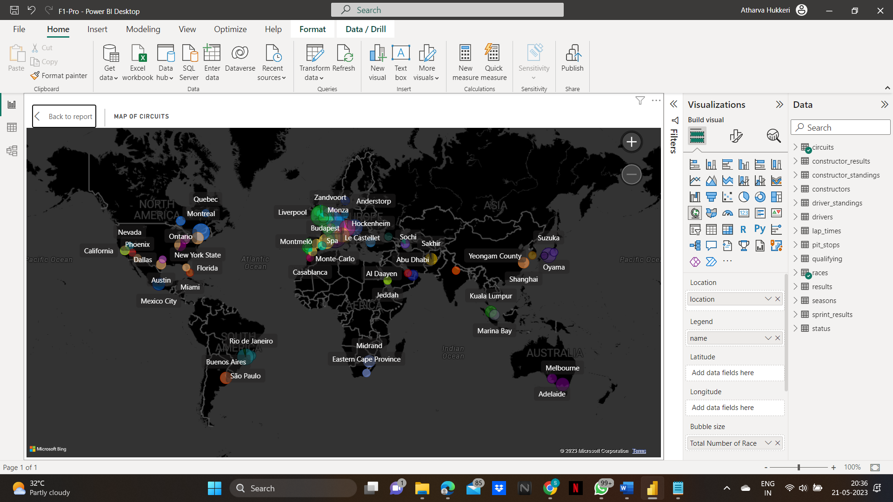

# F1-Performance-Analysis

## Problem Statement
Formula 1 teams need an economic solution to 
automate their data analysis. It is impossible for teams to manually sift through 500GB of data in 
time to prepare for the next race. Therefore, teams that attempt to do so are forced to make 
decisions without knowing crucial information that was lost in the data. To address the needs of 
handling data volume and a timely analysis, an automated, visual data dashboard should be used 
by these teams. The objective of this project will be to research and analyse the performance 
of drivers and their teams through visual dashboard.

## Analytical Tool Used
📌Microsoft PowerBI

## Dataset Used
Dataset used if Formula 1 World Championship (1950-2023). The dataset consists of all information 
on the Formula 1 races, drivers, constructors, qualifying, circuits, lap times, pit stops, championships 
from 1950 till the latest 2023 season.

## Key Features of Dashboard
Performance Analysis of: 
📌The racers best racers.  
📌Most successful Racer of a of top teams for specific year/all time.  
📌Top 3 teams.  
📌Total wins by specific team.  

## Features of Dashboard
📍Slicer

📍Map

📍Line and Stacked Column Chart

📍Stacked Bar Chart

📍Funnel

📍Donut Chart

